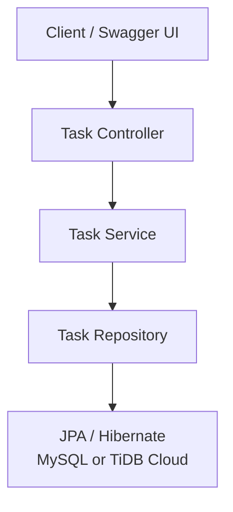
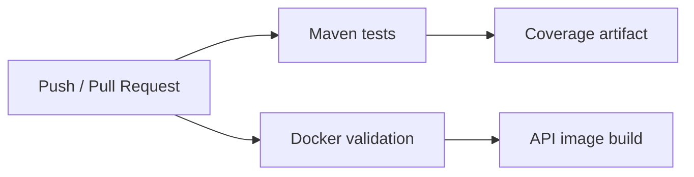
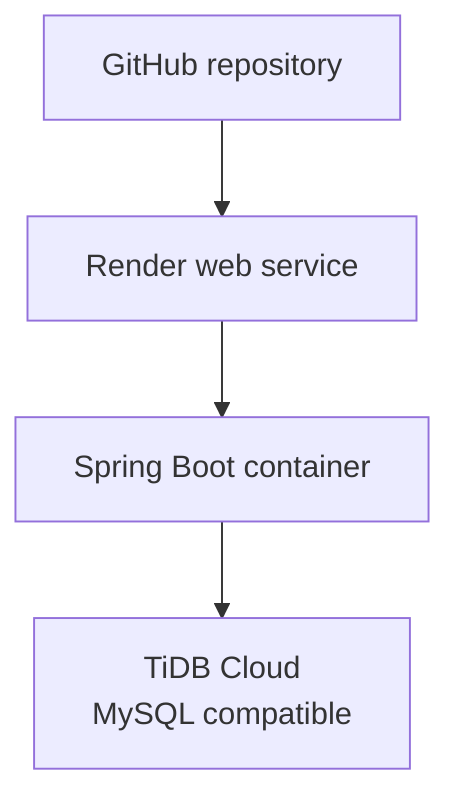

# SmartTask API

[](https://openjdk.org/projects/jdk/17/)
[](https://spring.io/projects/spring-boot)
[](https://github.com/Anjalisingh127/smarttask-api/actions/workflows/ci.yml)
[](Dockerfile)

SmartTask API is a production-style REST API for managing tasks. It demonstrates layered Spring Boot design, input validation, consistent error handling, MySQL-compatible persistence, automated tests, Docker packaging, CI, and cloud deployment.

> **Live deployment:** [Open Swagger UI](https://smarttask-api-esz2.onrender.com/swagger-ui/index.html)  
> The Render free service may take a short time to wake up after inactivity.

## Live links

| Resource | URL |
| --- | --- |
| Interactive API documentation | [Swagger UI](https://smarttask-api-esz2.onrender.com/swagger-ui/index.html) |
| OpenAPI specification | [OpenAPI JSON](https://smarttask-api-esz2.onrender.com/v3/api-docs) |
| Example deployed request | [GET /api/tasks/1](https://smarttask-api-esz2.onrender.com/api/tasks/1) |
| Source code | [GitHub repository](https://github.com/Anjalisingh127/smarttask-api) |

## What this project demonstrates

- RESTful CRUD operations with meaningful HTTP status codes
- A controller → service → repository architecture
- DTO-based request and response models
- Bean Validation for API input
- Centralized JSON error responses
- JPA/Hibernate persistence with MySQL or TiDB Cloud
- Filtering tasks by status and priority
- OpenAPI documentation through Swagger UI
- Unit and controller tests with JUnit 5, Mockito, and MockMvc
- Multi-stage Docker builds and Docker Compose
- GitHub Actions checks for Maven tests and Docker image builds
- Deployment on Render with a managed TiDB Cloud database

## Architecture



| Layer | Responsibility |
| --- | --- |
| Controller | Maps HTTP requests, validates input, and returns response codes |
| Service | Applies business rules and maps entities to response DTOs |
| Repository | Uses Spring Data JPA for task persistence and queries |
| Model and DTOs | Separate database entities from the public API contract |
| Exception handling | Converts validation and missing-resource failures into consistent JSON |
| Persistence | Stores tasks in a MySQL-compatible relational database |

### Request flow

1. A client sends an HTTP request to a task endpoint.
2. The controller validates the request DTO.
3. The service applies task-management rules.
4. The repository reads or writes task records.
5. The API returns a response DTO or a structured error.

More detail is available in [docs/architecture.md](docs/architecture.md).

## Technology stack

| Area | Technology |
| --- | --- |
| Language | Java 17 |
| Framework | Spring Boot 3.5.6 |
| Web | Spring Web |
| Persistence | Spring Data JPA, Hibernate |
| Database | MySQL 8 locally; TiDB Cloud in production |
| Validation | Jakarta Bean Validation |
| API documentation | springdoc-openapi and Swagger UI |
| Testing | JUnit 5, Mockito, Spring MockMvc |
| Coverage | JaCoCo |
| Packaging | Maven, Docker multi-stage build |
| Local orchestration | Docker Compose |
| CI | GitHub Actions |
| Deployment | Render and TiDB Cloud |

## API endpoints

Base path: `/api/tasks`

| Method | Endpoint | Description | Success |
| --- | --- | --- | --- |
| `POST` | `/api/tasks` | Create a task | `201 Created` |
| `GET` | `/api/tasks` | List tasks; optionally filter by status and priority | `200 OK` |
| `GET` | `/api/tasks/{id}` | Retrieve one task | `200 OK` |
| `PUT` | `/api/tasks/{id}` | Replace a task's editable fields | `200 OK` |
| `PATCH` | `/api/tasks/{id}/status` | Update only the task status | `200 OK` |
| `DELETE` | `/api/tasks/{id}` | Delete a task | `204 No Content` |

Supported values:

- Priority: `LOW`, `MEDIUM`, `HIGH`
- Status: `TODO`, `IN_PROGRESS`, `COMPLETED`

### Example request

```bash
curl -i -X POST "https://smarttask-api-esz2.onrender.com/api/tasks" \
  -H "Content-Type: application/json" \
  -d '{
    "title": "Prepare release",
    "description": "Verify the deployed API",
    "priority": "HIGH"
  }'
```

Example successful response:

```json
{
  "id": 2,
  "title": "Prepare release",
  "description": "Verify the deployed API",
  "priority": "HIGH",
  "status": "TODO",
  "createdAt": "2026-09-23T17:45:40.519824Z",
  "updatedAt": "2026-09-23T17:45:40.519824Z"
}
```

Validation and missing records return structured errors:

```json
{
  "status": 400,
  "message": "title: must not be blank",
  "timestamp": "2026-09-23T17:45:40Z"
}
```

## Run locally

### Prerequisites

- JDK 17 or newer
- Maven 3.9+
- MySQL 8+

### 1. Create a local database and user

```sql
CREATE DATABASE smarttask;
CREATE USER 'smarttask'@'localhost' IDENTIFIED BY 'choose-a-local-password';
GRANT ALL PRIVILEGES ON smarttask.* TO 'smarttask'@'localhost';
```

### 2. Configure environment variables

PowerShell:

```powershell
$env:DB_URL = "jdbc:mysql://localhost:3306/smarttask"
$env:DB_USERNAME = "smarttask"
$env:DB_PASSWORD = "choose-a-local-password"
```

Bash:

```bash
export DB_URL="jdbc:mysql://localhost:3306/smarttask"
export DB_USERNAME="smarttask"
export DB_PASSWORD="choose-a-local-password"
```

Never commit database credentials.

### 3. Build and start the application

```bash
mvn clean verify
mvn spring-boot:run
```

Then open:

- Swagger UI: <http://localhost:8080/swagger-ui.html>
- OpenAPI JSON: <http://localhost:8080/v3/api-docs>

## Run with Docker Compose

Docker Compose starts the API and a MySQL 8 container. Copy the environment template first:

```bash
cp .env.example .env
```

Windows PowerShell:

```powershell
Copy-Item .env.example .env
```

Replace the placeholders in `.env`, then run:

```bash
docker compose up --build
docker compose ps
```

The API is available on port `8080`. MySQL is exposed on host port `3307` to avoid conflict with a local MySQL server on `3306`.

Stop the containers while preserving data:

```bash
docker compose down
```

Remove the containers and database volume:

```bash
docker compose down --volumes
```

> `docker compose down --volumes` permanently deletes the Docker-managed database data.

## Testing and quality

Run the complete verification suite:

```bash
mvn clean verify
```

Current verified results:

- 22 automated tests
- 0 failures, 0 errors, and 0 skipped tests
- 90.91% line coverage (60 of 66 lines)
- 100% branch coverage (4 of 4 branches)

The JaCoCo HTML report is generated at `target/site/jacoco/index.html`. Tests mock the repository and do not require a running database.

See [docs/testing.md](docs/testing.md) for the test strategy.

## CI pipeline

Every push and pull request runs GitHub Actions checks for:

1. Maven compilation and tests
2. JaCoCo report generation and upload
3. Docker Compose configuration validation
4. Docker image build validation



## Deployment



Production configuration is supplied through environment variables:

| Variable | Purpose |
| --- | --- |
| `DB_URL` | JDBC connection URL |
| `DB_USERNAME` | Database username |
| `DB_PASSWORD` | Database password |
| `PORT` | HTTP port provided by the hosting platform |

No credentials are stored in the repository.

## Project structure

```text
smarttask-api/
├── .github/workflows/ci.yml
├── docs/
├── src/
│   ├── main/java/com/anjali/smarttask/
│   │   ├── controller/
│   │   ├── dto/
│   │   ├── exception/
│   │   ├── factory/
│   │   ├── model/
│   │   ├── repository/
│   │   └── service/
│   ├── main/resources/application.properties
│   └── test/
├── Dockerfile
├── compose.yaml
└── pom.xml
```

## Design decisions

- DTOs prevent persistence entities from becoming the public API contract.
- Constructor injection keeps dependencies explicit and testable.
- The service layer owns business logic instead of placing it in controllers.
- Centralized exception handling keeps error responses consistent.
- Environment-based configuration supports local, containerized, and cloud execution.
- A named Docker volume preserves local database data across container restarts.

## Verified behavior

The project has been exercised beyond automated tests:

- CRUD operations were verified through Swagger UI.
- Created tasks were confirmed in the database.
- Docker Compose successfully started separate API and MySQL containers.
- Task data remained available after container restarts.
- The deployed Render service successfully reads and writes TiDB Cloud data.
- The GitHub Actions Maven and Docker jobs completed successfully.

## Current scope

This is a backend portfolio project. It intentionally does not include a frontend, authentication, user ownership, pagination, or production observability.

Possible next improvements include Spring Security with JWT, pagination and sorting, database migrations with Flyway, integration tests with Testcontainers, and centralized logging or metrics.

## Additional resources

- [Architecture notes](docs/architecture.md)
- [Testing strategy](docs/testing.md)
- [Postman collection](docs/SmartTask.postman_collection.json)

## Author

**Anjali Singh** — [GitHub](https://github.com/Anjalisingh127)
