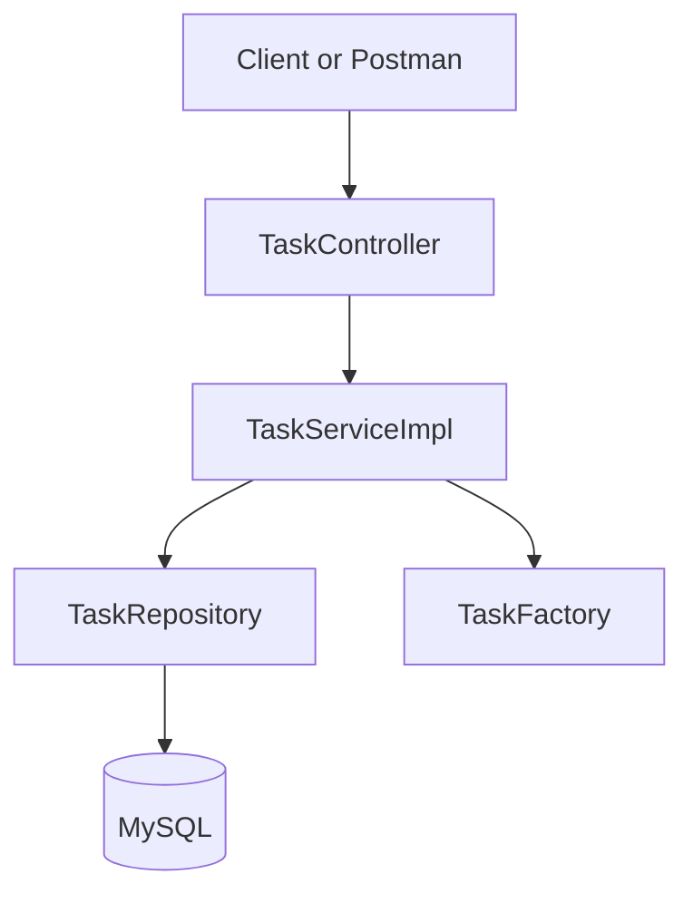

# Architecture and decisions

SmartTask tracks internal development tasks through a small JSON API. `TaskController` translates HTTP requests and validates DTOs. `TaskServiceImpl` owns create, lookup, update, filter, and delete operations. `TaskRepository` is the Spring Data JPA persistence boundary backed by MySQL. `TaskFactory` centralizes new entity defaults; JPA lifecycle hooks record creation and update times. Request and response DTOs keep persistence entities out of the public API. `GlobalExceptionHandler` standardizes validation and missing-resource responses.

The Repository pattern isolates database access and lets service tests mock it. The Factory pattern creates tasks with `TODO` status and trimmed titles. Spring dependency injection wires the components. Enum values are stored as strings so database values stay readable. `JpaSpecificationExecutor` combines optional status and priority filters. `saveAndFlush` returns timestamps populated by JPA hooks before the response is mapped.

`PUT` updates the editable fields but retains status; `PATCH` changes only status. Titles must contain non-whitespace characters and have at most 120 characters; descriptions at most 2,000 characters; priority and status accept only documented enum values. MySQL data survives application restarts. Schema creation uses Hibernate `update` for local development; a production system should use migrations such as Flyway.
